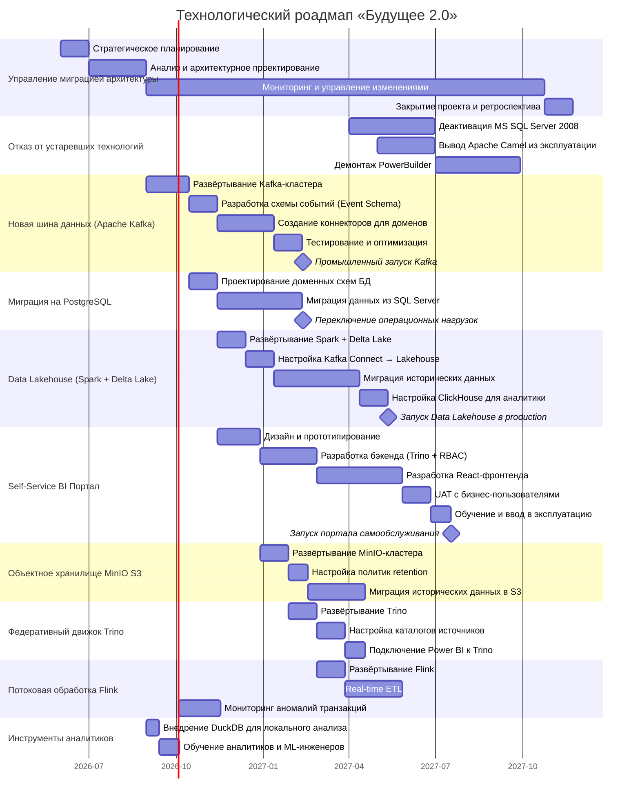

# Технологический роадмап «Будущее 2.0»

> Версия от 2026-05-01. Горизонт планирования: 18 месяцев.

## Технологический радар «Будущее 2.0»

Технический радар отражает текущий и целевой технологический ландшафт компании.

Для запуска интерактивного радара:

```bash
cd Task3/tech_radar
npm install
npm run build
npm run serve
# Открыть http://localhost:3000
```

---

## Роадмап изменений



---

## Шаги запуска портала самообслуживания

| Этап | Описание | Срок |
|---|---|---|
| **1. Проектирование сценариев** | Определение ролей (главврач, финдиректор, аналитик), прототипирование интерфейса, макеты отчётов | 2026-09 |
| **2. Бэкенд (Trino + RBAC)** | API-слой поверх Trino, Row-Level Security, кэширование запросов, SSO | 2026-11 – 2027-02 |
| **3. Интеграция витрин** | Подключение к data products доменов через Trino, федеративные запросы | 2027-01 |
| **4. Разработка фронтенда** | React, конструктор отчётов, дашборды с RBAC-фильтрацией | 2027-02 – 2027-05 |
| **5. UAT и ввод** | Тестирование с бизнес-пользователями, обучение, официальный запуск | 2027-06 – 2027-07 |

---

## Инициативы обеспечения независимости подразделений

| Инициатива | Описание |
|---|---|
| **Data Contracts** | Стандарт описания data products (схема, владелец, политики доступа). Реестр контрактов на базе DataHub |
| **Обучение доменных команд** | Воркшопы по Data Mesh, ответственности за данные, публикации data products |
| **Платформа самообслуживания** | Инструменты регистрации data products, автоматическая проверка контрактов, версионирование |
| **Федеративное управление** | Совет по данным из представителей доменов, политики качества и безопасности |
| **Мониторинг контрактов** | Автоматические проверки соответствия данных опубликованным контрактам, алертинг |

---

## Меры обеспечения качества сервисов

| Мера | Описание | Инструменты |
|---|---|---|
| **Контроль качества данных** | Профилирование данных в витринах, DQ-правила для медицинских и финансовых показателей | Great Expectations, Airflow |
| **Управление доступом и аудит** | Централизованная система SSO + RBAC. Логирование всех запросов для расследования инцидентов | Keycloak, Open Policy Agent |
| **Защита конфиденциальных данных** | Динамическое маскирование на уровне Trino — медицинские данные не попадают в витрину | Trino Row Filters, Column Masking |
| **Аудит безопасности** | Периодическое тестирование на проникновение, анализ логов, ревью политик | SIEM-система, Wazuh |

---

## Обоснование изменений

### Этап 0 — Планирование (месяц 1–3)

**Что:** Аудит данных, определение доменных границ, подготовка облачной инфраструктуры.

**Зачем:** Без чёткого плана миграции компания рискует получить «big bang» переход, который остановит бизнес. Поэтапный подход позволяет мигрировать без остановки операций.

**Влияние на бизнес:** Снижение риска; базис для всех последующих этапов.

---

### Этап 1 — Apache Kafka (месяц 3–6)

**Что:** Развёртывание Kafka как асинхронной шины событий. Замена Apache Camel.

**Зачем:** Apache Camel — синхронная централизованная шина, единая точка отказа. Kafka обеспечивает асинхронную передачу событий: домены независимы, добавление нового партнёра не требует изменения маршрутов.

**Влияние на бизнес:**
- Надёжность: сбой одного домена не останавливает другие.
- Scalability: Kafka горизонтально масштабируется до миллионов событий в секунду.
- Time-to-market: новый партнёр подключается за дни, а не месяцы.

---

### Этап 2 — PostgreSQL (месяц 4–7)

**Что:** Вынос оперативных данных клиник и финтех из DWH в доменные PostgreSQL БД.

**Зачем:** Монолитный DWH — узкое место. Любое изменение в финтех затрагивает клиники и наоборот. Доменные БД обеспечивают независимость команд.

**Влияние на бизнес:**
- Независимость: финтех-команда деплоит изменения схемы без согласования с клиниками.
- Производительность OLTP: оперативные запросы не конкурируют с аналитическими.
- Соответствие регуляторам: финансовые и медицинские данные физически разделены.

---

### Этап 3 — Data Lakehouse: Spark + Delta Lake (месяц 5–10)

**Что:** Замена аналитической части MS SQL Server 2008 на Spark + Delta Lake + ClickHouse.

**Зачем:** SQL Server 2008 — end-of-life, не масштабируется на сотни ТБ. Spark + Delta Lake горизонтально масштабируется в облаке. Сложные отчёты — за минуты, а не часы.

**Влияние на бизнес:**
- Скорость принятия решений: отчёты за 2–5 минут вместо нескольких часов.
- Снижение затрат: облачные ресурсы масштабируются по требованию, оплата за использование.
- Compliance: Delta Lake поддерживает time travel — аудит любого изменения данных.

---

### Этап 4 — Self-Service BI Портал (месяц 6–13)

**Что:** React-фронтенд + Trino + Power BI Embedded. Пользователи строят отчёты самостоятельно.

**Зачем:** Сейчас каждый отчёт требует участия ИТ — это замедляет бизнес. Портал самообслуживания убирает это узкое место.

**Влияние на бизнес:**
- Скорость: новый отчёт за минуты, а не дни ожидания ИТ.
- Масштабируемость: любое новое подразделение просто получает доступ к порталу.
- Качество решений: руководители работают с актуальными данными, а не с устаревшими Excel-выгрузками.

---

### Этап 5 — MinIO S3 и Trino (месяц 8–12)

**Что:** Объектное хранилище для архивных данных и федеративный движок Trino.

**Зачем:** Хранение сотен ТБ исторических данных в дорогих SSD-дисках неэффективно. MinIO обеспечивает дешёвое объектное хранилище. Trino позволяет запрашивать данные из всех источников без их копирования.

**Влияние на бизнес:**
- Снижение затрат: стоимость хранения исторических данных снижается в 5–10 раз.
- Гибкость: новый источник данных добавляется в Trino без ETL-пайплайнов.

---

### Этап 6 — Apache Flink (месяц 10–14)

**Что:** Real-time потоковая обработка: Kafka → ClickHouse. Мониторинг аномалий.

**Зачем:** Финансовые данные требуют мониторинга в реальном времени — мошеннические транзакции должны выявляться за секунды, а не обнаруживаться в ночном батч-отчёте.

**Влияние на бизнес:**
- Качество финансовых сервисов: обнаружение аномалий в реальном времени.
- Актуальность данных в дашбордах: обновление за секунды, а не раз в сутки.
- Конкурентное преимущество: банковские клиенты ожидают real-time уведомлений.
